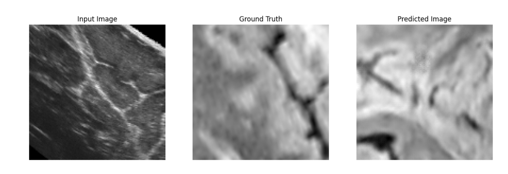

# BrainVoxGen
BrainVoxGen is a GAN-based architecture that synthesizes MRI volumes from ultrasound volumes. The model used is a modified pix2pix architecture and was trained on a small dataset of paired ultrasound and MRI volumes.

### Observed results:


### Model architecture:


### To run the model:
> ```python -m pip install -r requirements.txt``` <br>
> ```python -m jupyterlab``` <br>
> Run ```VoxGen.ipynb``` <br>
